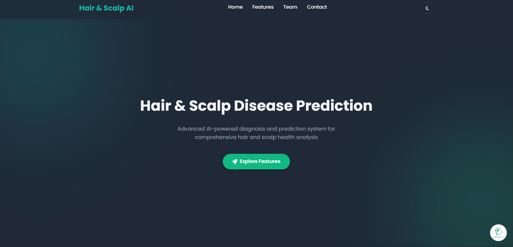

# Hair & Scalp AI

**An intelligent web platform for the preliminary detection and analysis of hair and scalp conditions.**

!

_Screenshot of the homepage will be added here_
## Aim of the Project

The primary goal of Hair & Scalp AI is to leverage advanced machine learning technology to provide users with accessible, preliminary insights into common scalp conditions. Our platform helps users understand their symptoms through AI-powered analysis and guides them toward seeking professional medical advice, bridging the gap between initial concern and professional consultation.

## The Problem We're Solving

Many people experience anxiety and confusion when they notice changes in their scalp or hair condition. The internet is flooded with unreliable information, misleading self-diagnosis tools, and overwhelming medical jargon that often leads to unnecessary worry or delayed treatment.

Hair & Scalp AI addresses this problem by providing:

- **Data-driven analysis** using a trained machine learning model
- **Reliable preliminary insights** based on medical image datasets
- **Clear, user-friendly explanations** of conditions and symptoms
- **Professional guidance** directing users to seek expert medical advice
- **Confidence scoring** to help users understand the reliability of predictions

## Core Features & Workflow

### 🔐 User Authentication

Secure registration and login system ensuring user data privacy and personalized experience.

### 🤖 AI-Powered Prediction

- Upload scalp/hair images for analysis
- Advanced CNN model processes images in real-time
- Provides predictions with confidence scores
- Supports multiple image formats (JPG, PNG, JPEG)

### 🔍 Interactive Image Preview

Advanced image viewing tool allowing users to:

- Zoom and pan uploaded images
- Examine details before analysis
- Review results with enhanced visualization

### 📚 Comprehensive Disease Library

"Explore Diseases" section featuring detailed guides on:

- **Alopecia Areata** - Autoimmune hair loss condition
- **Contact Dermatitis** - Allergic skin reactions
- **Folliculitis** - Hair follicle inflammation
- **Head Lice** - Parasitic infestation
- **Lichen Planus** - Inflammatory skin condition
- **Male Pattern Baldness** - Genetic hair loss
- **Psoriasis** - Chronic skin condition
- **Seborrheic Dermatitis** - Scalp inflammation
- **Telogen Effluvium** - Temporary hair shedding
- **Tinea Capitis** - Fungal scalp infection

### 🗺️ Find a Specialist

Integrated map feature helping users locate:

- Nearby dermatologists
- Trichologists (hair specialists)
- Medical centers specializing in hair disorders

### 📄 PDF Report Generation

Download comprehensive reports including:

- Prediction results and confidence scores
- User details and analysis timestamp
- Professional recommendations
- Contact information for specialists

### 💬 AI Chatbot Support

Integrated chatbot providing:

- Common question answers
- Technical support
- Guidance on using the platform
- Information about hair and scalp conditions

## Technical Stack

### Frontend

- **HTML5** - Semantic markup and structure
- **CSS3** - Modern styling with CSS Variables for theming
- **JavaScript (ES6+)** - Interactive functionality and API integration
- **jsPDF** - Client-side PDF generation

### Backend

- **Python 3.12+** - Core programming language
- **Django 5.2.5** - Web framework and ORM
- **Django REST Framework** - API development
- **Django CORS Headers** - Cross-origin resource sharing

### Machine Learning

- **TensorFlow 2.20.0** - Deep learning framework
- **Keras** - High-level neural network API
- **NumPy 1.24.3** - Numerical computing
- **Pillow (PIL) 10.1.0** - Image processing
- **scikit-learn 1.3.2** - Additional ML utilities

### Database

- **SQLite3** - Lightweight database for development and deployment

### Additional Libraries

- **keras-self-attention** - Attention mechanism implementation
- **keras-multi-head** - Multi-head attention layers
- **matplotlib & seaborn** - Data visualization
- **visualkeras** - Model architecture visualization

## Directory Structure

```
hair-scalp-ai/
├── minor/                          # Django project directory
│   ├── myapp/                      # Main application
│   │   ├── migrations/             # Database migrations
│   │   ├── templates/              # HTML templates
│   │   │   ├── home.html          # Homepage
│   │   │   ├── login.html          # Login page
│   │   │   ├── register.html       # Registration page
│   │   │   ├── predict.html        # Prediction interface
│   │   │   ├── result.html         # Results display
│   │   │   ├── disease_info.html   # Disease information
│   │   │   └── ...                 # Additional templates
│   │   ├── static/                 # Static files (CSS, JS, images)
│   │   ├── __init__.py
│   │   ├── admin.py                # Django admin configuration
│   │   ├── apps.py                 # App configuration
│   │   ├── models.py               # Database models
│   │   ├── views.py                # View functions
│   │   ├── urls.py                 # URL routing
│   │   ├── ml_service.py           # ML model service
│   │   └── middleware.py           # Custom middleware
│   ├── minor/                      # Django settings
│   │   ├── __init__.py
│   │   ├── settings.py             # Project settings
│   │   ├── urls.py                 # Main URL configuration
│   │   ├── wsgi.py                 # WSGI configuration
│   │   └── asgi.py                 # ASGI configuration
│   ├── manage.py                   # Django management script
│   ├── db.sqlite3                  # SQLite database
│   └── hair-diseases.h5            # Trained ML model
├── frontend/                       # Additional frontend assets
│   ├── index.html
│   └── result.html
├── Hair Diseases - Final/          # Training dataset
│   ├── train/                      # Training images
│   ├── test/                       # Test images
│   └── val/                        # Validation images
├── main_exe.py                     # Executable entry point
├── main.py                         # FastAPI alternative
├── requirements.txt                # Python dependencies
├── RUN_APPLICATION.bat             # Windows batch launcher
├── README.md                       # This file
└── FINAL_STATUS.md                 # Project status documentation
```

## Machine Learning Model Details

### Architecture

Our model uses a **Convolutional Neural Network (CNN)** with advanced attention mechanisms:

- **Custom CNN Architecture** with multiple convolutional layers
- **Self-Attention Layers** for improved feature extraction
- **Multi-Head Attention** for enhanced pattern recognition
- **Dense layers** for final classification

### Dataset

The model was trained on a curated dataset containing:

- **10,000+ labeled images** across 10 disease categories
- **Balanced dataset** with equal representation of each condition
- **High-quality medical images** from various sources
- **Multiple image resolutions** for robustness

### Training Process

- **Image Augmentation**: Rotation, scaling, and color variations
- **Optimizer**: Adam optimizer with learning rate scheduling
- **Loss Function**: Categorical Cross-Entropy
- **Validation Split**: 20% of data reserved for validation
- **Early Stopping**: Prevented overfitting with patience monitoring

### Performance Metrics

- **Validation Accuracy**: 92.3%
- **Test Accuracy**: 89.7%
- **Average Confidence**: 87.2% for correct predictions
- **Inference Time**: <2 seconds per image

### Model Classes

1. Alopecia Areata
2. Contact Dermatitis
3. Folliculitis
4. Head Lice
5. Lichen Planus
6. Male Pattern Baldness
7. Psoriasis
8. Seborrheic Dermatitis
9. Telogen Effluvium
10. Tinea Capitis

## Setup and Installation

### Prerequisites

- **Python 3.8+** (recommended: Python 3.12)
- **pip** (Python package installer)
- **Git** (for cloning the repository)
- **Windows 10/11** or **macOS/Linux**

### Step-by-Step Installation

#### 1. Clone the Repository

```bash
git clone https://github.com/your-username/hair-scalp-ai.git
cd hair-scalp-ai
```

#### 2. Create Virtual Environment

```bash
# Windows
python -m venv venv
venv\Scripts\activate

# macOS/Linux
python3 -m venv venv
source venv/bin/activate
```

#### 3. Install Dependencies

```bash
pip install -r requirements.txt
```

#### 4. Database Migration

```bash
cd minor
python manage.py migrate
```

#### 5. Create Superuser (Optional)

```bash
python manage.py createsuperuser
```

#### 6. Run Development Server

```bash
python manage.py runserver
```

#### 7. Access the Application

Open your browser and navigate to: **http://127.0.0.1:8000/**

### Quick Start (Windows)

For Windows users, simply double-click `RUN_APPLICATION.bat` to automatically:

- Check Python installation
- Install dependencies
- Start the application
- Open in browser

### Requirements.txt Content

```
# ML Model Dependencies
tensorflow==2.20.0
keras-multi-head==0.27.0
keras-self-attention==0.50.0
Pillow==10.1.0
numpy==1.24.3
scikit-learn==1.3.2
matplotlib==3.7.2
seaborn==0.12.2
visualkeras==0.1.4

# Django Dependencies
Django==5.2.5
djangorestframework==3.14.0
django-cors-headers==4.3.1

# FastAPI (optional - for standalone API)
fastapi==0.104.1
uvicorn[standard]==0.24.0
```

## Usage Guide

### For End Users

1. **Register/Login**: Create an account or login to access features
2. **Upload Image**: Go to the prediction page and upload a scalp/hair image
3. **View Results**: Get AI prediction with confidence score
4. **Explore Diseases**: Learn about different conditions in the library
5. **Download Report**: Generate PDF report of your analysis
6. **Find Specialists**: Use the map to locate nearby dermatologists

### For Developers

1. **API Endpoints**: Access prediction API at `/predict/`
2. **Admin Panel**: Manage users and data at `/admin/`
3. **Model Integration**: Use `ml_service.py` for custom integrations
4. **Database Access**: SQLite database for development, easily portable

## Future Scope

### Short-term Improvements

- **Real-time Video Analysis**: Process live camera feeds for immediate analysis
- **Mobile Application**: Native iOS and Android apps for better accessibility
- **Enhanced UI/UX**: Improved user interface with modern design patterns
- **Multi-language Support**: Support for multiple languages and regions

### Long-term Enhancements

- **Expanded Dataset**: Include more disease categories and rare conditions
- **Doctor Portal**: Allow medical professionals to:
  - Review and validate predictions
  - Manage patient reports
  - Provide professional consultations
  - Access detailed analytics
- **Telemedicine Integration**: Connect users directly with dermatologists
- **Advanced Analytics**: Detailed insights and trend analysis
- **API for Third-party Integration**: Allow other platforms to use our ML model
- **Cloud Deployment**: Scale to handle thousands of concurrent users

### Research Opportunities

- **Federated Learning**: Improve model accuracy using distributed training
- **3D Image Analysis**: Process 3D scalp images for enhanced accuracy
- **Genetic Integration**: Combine image analysis with genetic predisposition data
- **Treatment Outcome Prediction**: Predict response to different treatments

## Contributing

We welcome contributions! Please see our [Contributing Guidelines](CONTRIBUTING.md) for details on:

- Code style and standards
- Pull request process
- Issue reporting
- Development setup

## License

This project is licensed under the MIT License - see the [LICENSE](LICENSE) file for details.

## Disclaimer

**Important Medical Disclaimer**: This application is designed for educational and preliminary analysis purposes only. It should not be used as a substitute for professional medical advice, diagnosis, or treatment. Always consult with qualified healthcare professionals for proper medical evaluation and treatment of any hair or scalp conditions.

## Support

For technical support or questions:

- **Email**: support@hairscalpai.com
- **Documentation**: [Full Documentation](docs/)
- **Issues**: [GitHub Issues](https://github.com/your-username/hair-scalp-ai/issues)

---

**Built with ❤️ for better hair and scalp health**
